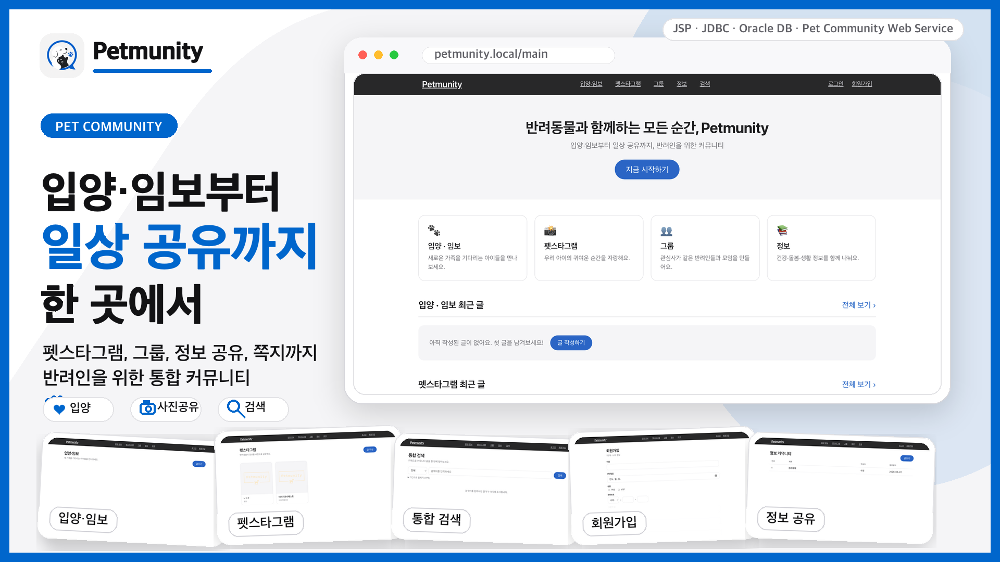
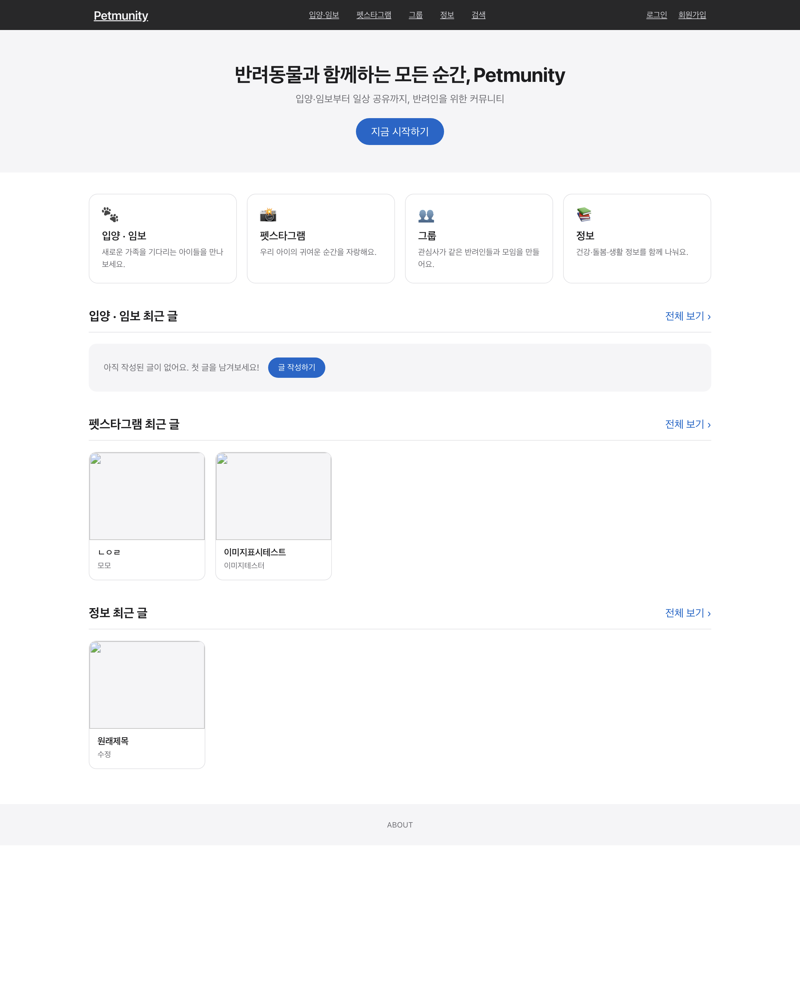
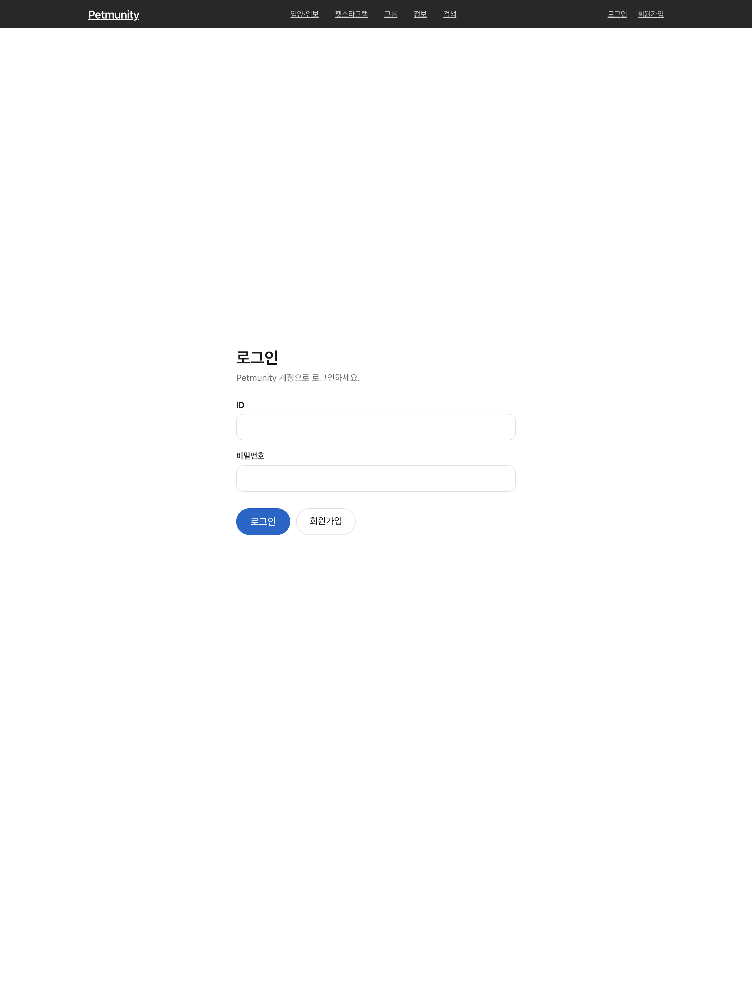
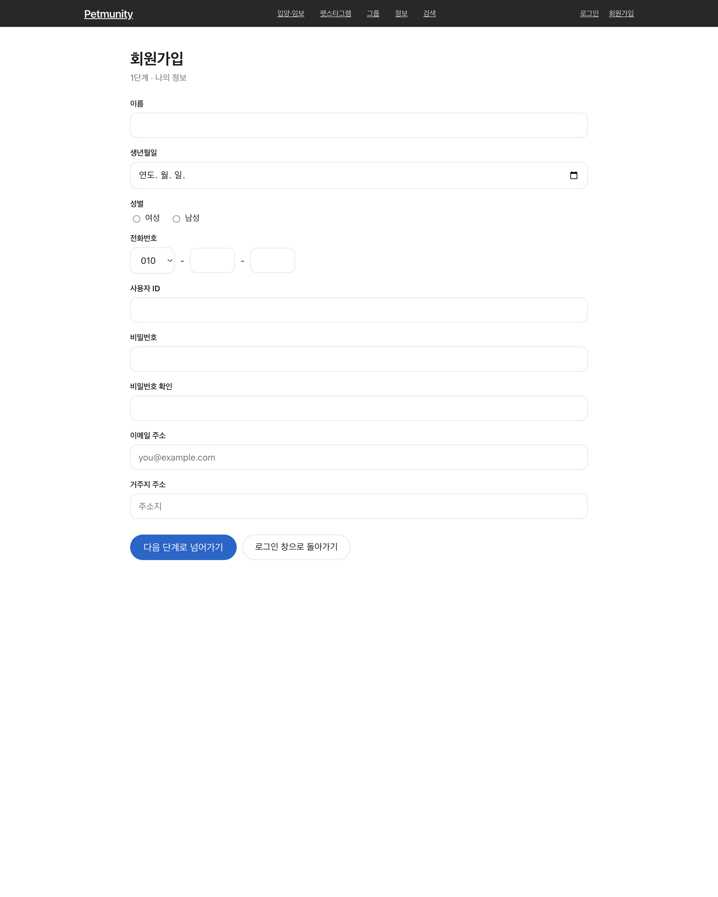
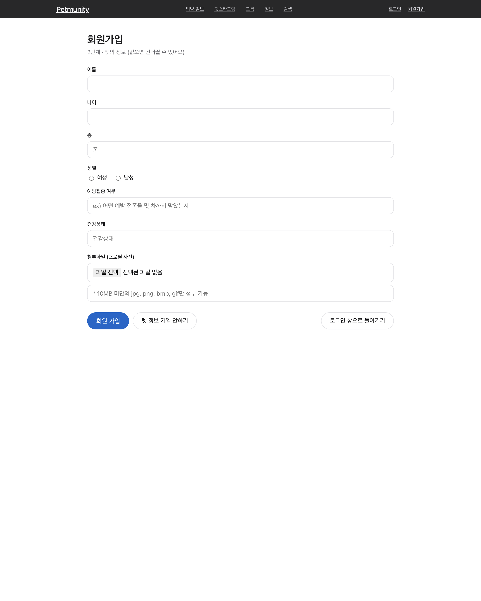
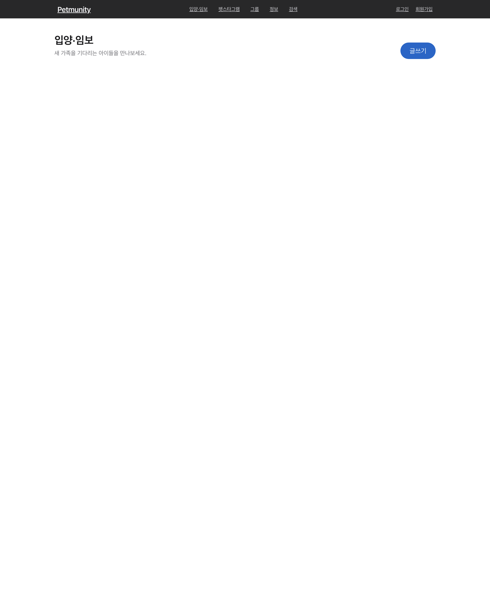
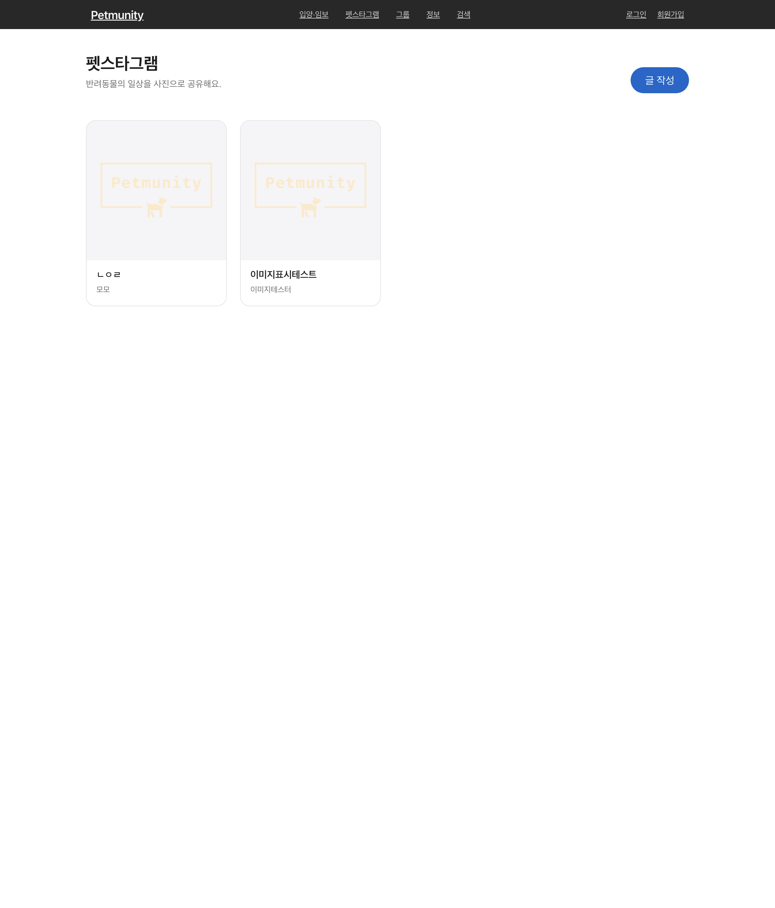
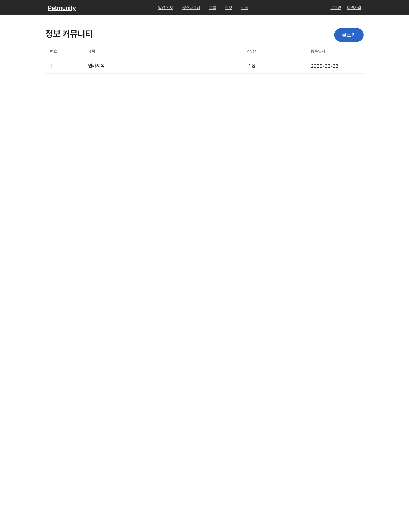
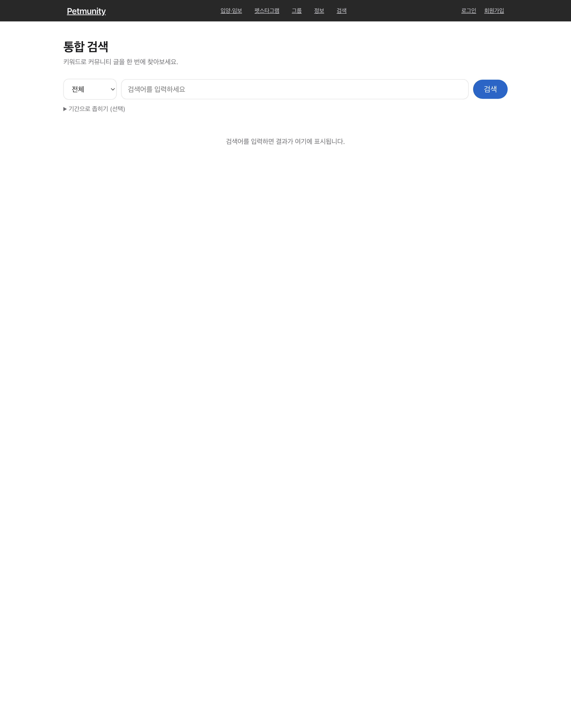
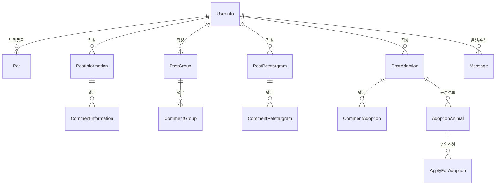

# 🐾 PETMUNITY

> ### "반려동물과 함께하는 모든 순간을, 한 곳에서"
>
> 입양/임보로 새 가족을 만나고, 우리 아이의 일상을 자랑하고, 정보를 나누고, 모임을 만드는 **반려동물 통합 커뮤니티**. 프레임워크 없이 **순수 Servlet/JSP MVC + Oracle**로 직접 구현한 데이터베이스 프로그래밍 팀 프로젝트입니다.

- **서비스명**: Petmunity (Pet + Community)
- **개발 기간**: 2022년 2학기 (데이터베이스 프로그래밍)
- **개발 인원**: 4명



# 목차

- [프로젝트 개요](#프로젝트-개요)
- [기획 배경](#기획-배경)
- [주요 화면 및 기능 소개](#주요-화면-및-기능-소개)
- [프로젝트 핵심 기술](#프로젝트-핵심-기술)
- [시스템 아키텍처](#시스템-아키텍처)
- [ERD](#erd)
- [DB 적용 및 실행](#db-적용-및-실행)
- [디렉토리 구조](#디렉토리-구조)
- [팀원 소개](#팀원-소개)
- [기술 스택](#기술-스택)

# 프로젝트 개요

### 📖 프로젝트 소개

**Petmunity**는 흩어져 있던 반려 생활을 하나로 묶은 **반려동물 통합 커뮤니티 웹 서비스**입니다.
입양/임보 공고와 신청, 펫스타그램(일상 공유), 그룹 모임, 정보 게시판, 회원 간 쪽지까지 - 반려인에게 필요한 활동을 한 곳에서 끝낼 수 있도록 설계했습니다.

### 🎯 프로젝트 목표

- 🐶 **입양 / 임보** - 동물 정보가 담긴 공고를 올리고 신청서로 새 가족을 연결
- 📸 **일상 공유** - 펫스타그램으로 반려동물의 순간을 기록하고 댓글로 소통
- 👥 **모임 / 정보** - 관심사가 맞는 사람들과 모이고 돌봄 정보를 나눔
- 🗄️ **밑바닥부터 구현** - 프레임워크에 기대지 않고 관계형 DB 설계와 순수 JDBC로 웹 백엔드 원리를 직접 다룸

# 기획 배경

반려 생활에 필요한 정보와 교류는 보통 여러 곳에 흩어져 있습니다. 입양 공고는 보호소/카페/블로그에, 일상 사진은 SNS에, 사육 정보는 검색 곳곳에, 모임은 단톡방에 따로따로 존재합니다.

**Petmunity**는 이 흩어진 반려 생활을 하나의 커뮤니티로 묶기 위해 기획되었습니다. "입양받고 → 키우면서 → 자랑하고 → 정보를 나누고 → 사람들과 모이는" 흐름을 한 플랫폼에서 이어갈 수 있도록 했습니다.

또한 **데이터베이스 프로그래밍** 교과 프로젝트인 만큼, 프레임워크 대신 **관계형 DB 설계와 순수 JDBC**로 직접 구현해 백엔드 동작 원리를 깊이 다루는 데 초점을 맞췄습니다.

# 주요 화면 및 기능 소개

## 🏠 메인

<table>
  <tr><td align="center"></td></tr>
</table>

- 입양/펫스타그램/그룹/정보 4개 커뮤니티로 들어가는 진입점과 최근 게시글을 한 화면에 모았습니다.

## 🔐 회원 / 인증

<table>
  <tr>
    <th>로그인</th>
    <th>회원가입 (1단계 / 회원)</th>
    <th>회원가입 (2단계 / 반려동물)</th>
  </tr>
  <tr>
    <td align="center"></td>
    <td align="center"></td>
    <td align="center"></td>
  </tr>
</table>

- **2단계 회원가입** - 회원 정보 입력 후 반려동물 정보 등록(건너뛰기 가능)
- 세션 기반 로그인 / 로그아웃, 글쓰기 등 보호된 동작은 로그인 사용자만
- 회원 정보 수정, **회원 탈퇴(소프트 삭제)** - 탈퇴해도 작성 글/댓글은 보존되고 작성자는 "탈퇴한 회원"으로 표시
- 로그인 실패 / 탈퇴 계정 안내 메시지

## 🐾 커뮤니티 게시판 (입양 / 펫스타그램 / 그룹 / 정보)

<table>
  <tr>
    <th>입양 / 임보 목록</th>
    <th>펫스타그램</th>
    <th>정보 게시판</th>
  </tr>
  <tr>
    <td align="center"></td>
    <td align="center"></td>
    <td align="center"></td>
  </tr>
</table>

- 4개 게시판 공통 **글 작성 / 조회 / 수정 / 삭제(CRUD)**, **이미지 업로드**, **댓글**(작성자만 수정/삭제)
- **입양 / 임보**: 공고글 + 동물 정보(종/성별/나이/건강/접종/사진) 동시 등록, 다른 사용자의 **입양 신청서** 접수
- **그룹**: 모임 개설, 모집 인원 설정, 멤버 참여
- 게시글 삭제 시 **달린 댓글/연관 데이터까지 함께 정리**(입양글은 동물 정보/신청서 포함)

## 🔎 통합 검색 / 쪽지 / 마이페이지

<table>
  <tr><td align="center"></td></tr>
</table>

- **통합 검색**: 커뮤니티 종류 + 키워드(+ 기간)로 4개 게시판을 한 번에 검색해 통합 결과로 표시
- **쪽지**: 회원 간 쪽지 보내기(받은/보낸함), 수신자 존재 확인, 나에게 보내기, 삭제 지원
- **마이페이지**: 내가 쓴 글 / 내 댓글 모아보기, 회원 정보 수정, 반려동물 정보 수정 / 삭제

# 프로젝트 핵심 기술

## 🧭 프레임워크 없는 MVC - 프런트 컨트롤러 직접 구현

- 모든 요청을 **`DispatcherServlet`(Front Controller)** 한 곳에서 받고, `RequestMapping`이 URL → `Controller`로 분기합니다.
- 각 `Controller`는 공통 인터페이스(`execute`)를 구현해 처리 결과로 **forward(JSP)** 경로 또는 **`redirect:` 경로**를 반환하고, 디스패처가 이동을 담당합니다.

## 🗄️ 커넥션 풀 기반 DB 접근 (DBCP2)

- 매 요청마다 커넥션을 새로 만들지 않고 **Apache Commons DBCP2 커넥션 풀**에서 빌려 쓰고 반납합니다.
- `ConnectionManager`(풀 래퍼) → `JDBCUtil`(쿼리 실행 / 트랜잭션) → `DAO` 로 이어지는 데이터 접근 계층을 직접 설계했고, 커밋/롤백과 자원 반납을 명시적으로 다루며 순수 JDBC를 학습했습니다.
- 시퀀스(`user_seq`, `p0_seq`~`p3_seq`, `c0_seq`~`c3_seq` 등)로 PK를 생성합니다.

## 🧩 4개 게시판의 일관된 도메인 구조 (P0~P3)

- 정보(P0) / 그룹(P1) / 펫스타그램(P2) / 입양(P3) 게시판을 **동일한 번호 체계**로 통일해, 게시글(`Post*`)과 댓글(`Comment*`) / DAO / 컨트롤러를 일관된 패턴으로 구현했습니다.
- 입양(P3)은 공고글에 **동물 정보(`AdoptionAnimal`)** 를 함께 등록하고, **입양 신청서(`ApplyForAdoption`)** 로 신청을 받는 확장 워크플로우를 가집니다.

## 🖼️ 이미지 업로드 - S3 / 로컬 전환형 저장소

- 업로드 이미지는 **영문 파일명(UUID + 확장자)** 으로 저장해 한글 파일명/인코딩 이슈를 피합니다.
- `StorageUtil`이 저장소를 추상화 - `aws.properties`에 S3 설정이 있으면 **AWS S3**에, 없으면 **로컬 폴더**에 자동 저장(폴백)합니다. 자격증명은 `.gitignore` 처리해 커밋되지 않습니다.
- 저장된 이미지는 `ImageController`가 `/image?file=...` 로 **직접 스트리밍**해, 톰캣 정적 서빙 캐시 문제를 우회합니다.

## 🔗 데이터 정합성 - 애플리케이션 레벨 정리

- 연관 데이터 정리를 **서비스 코드에서 직접** 수행합니다. 게시글을 삭제하면 그 글의 댓글(입양글은 동물 정보 / 신청서까지)을 함께 정리하고, **회원 탈퇴는 소프트 삭제**로 처리해 작성한 글 / 댓글을 보존하면서 탈퇴 상태(`status`)만 표시합니다.

# 시스템 아키텍처

프런트 컨트롤러 패턴 기반의 **계층형 MVC** 구조입니다.

```text
User Browser
  └─ Filter (Encoding / Resource)
      └─ DispatcherServlet  (Front Controller)
          └─ RequestMapping  (URL → Controller 매핑)
              └─ Controller   (요청 처리, forward / redirect 결정)
                  └─ UserManager  (Service / 비즈니스 로직, 싱글톤 Facade)
                      └─ DAO → JDBCUtil → ConnectionManager (DBCP2 Pool)
                          └─ Oracle DB
          └─ View : JSP + JSTL   (forward 시 렌더링)
      └─ ImageController → StorageUtil (S3 / 로컬)  → 이미지 스트리밍
```

# ERD



> 게시판은 정보(P0)/그룹(P1)/펫스타그램(P2)/입양(P3) 4종이며 각각 `Post*` / `Comment*` 테이블을 가집니다. 입양 게시판은 `AdoptionAnimal`(동물 정보)과 `ApplyForAdoption`(입양 신청서)을 추가로 사용합니다. 전체 스키마는 [`src/main/resources/schema.sql`](src/main/resources/schema.sql) 참고.

# DB 적용 및 실행

### 1) 데이터베이스 준비

Oracle에 접속해 스키마를 생성합니다.

```sql
@src/main/resources/schema.sql
```

DB 접속 정보는 `src/main/resources/context.properties`에서 설정합니다.

```properties
db.url=jdbc:oracle:thin:@<host>:<port>/<service>
db.username=<user>
db.password=<password>
```

### 2) (선택) 이미지 S3 저장

`aws.properties.example`을 `aws.properties`로 복사해 값을 채우면 이미지가 S3에 저장됩니다. **비워두면 로컬 폴더에 저장**되며, `aws.properties`는 git에 커밋되지 않습니다.

### 3) 빌드 / 실행

```bash
mvn -q -DskipTests package
```

생성된 `target/Petmunity-0.0.1-SNAPSHOT.war`를 **Tomcat 9**에 배포한 뒤 `http://localhost:8080/Petmunity/` 로 접속합니다.

# 디렉토리 구조

```text
petmunity/
├── pom.xml
└── src/main
    ├── java
    │   ├── controller          # 프런트 컨트롤러 + 도메인별 Controller
    │   │   ├── DispatcherServlet.java
    │   │   ├── RequestMapping.java
    │   │   ├── ImageController.java
    │   │   └── post / comment / user / pet / message / apply
    │   ├── filter              # EncodingFilter, ResourceFilter
    │   ├── model
    │   │   ├── (도메인)        # UserInfo, Pet, Post*, Comment*, AdoptionAnimal, Apply, Message
    │   │   ├── service         # UserManager (비즈니스 로직, 싱글톤 Facade)
    │   │   └── dao             # DAO + JDBCUtil + ConnectionManager (DBCP2)
    │   └── util                # StorageUtil (S3 / 로컬 이미지 저장)
    ├── resources               # context.properties, schema.sql, aws.properties(.example)
    └── webapp
        └── WEB-INF
            ├── navbar.jsp      # 공통 내비게이션 + 디자인 시스템
            └── main / community / user / myPage / message / search
```

# 팀원 소개

<table>
  <tr>
    <td align="center" width="160">
      <a href="https://github.com/sondahyun"><br/><b>손다현</b></a><br/>
      <sub>@sondahyun</sub>
    </td>
    <td align="center" width="160">
      <a href="https://github.com/karamChoi2523"><br/><b>최가람</b></a><br/>
      <sub>@karamChoi2523</sub>
    </td>
    <td align="center" width="160">
      <a href="https://github.com/UN15"><br/><b>정재운</b></a><br/>
      <sub>@UN15</sub>
    </td>
    <td align="center" width="160">
      <a href="https://github.com/seungyeonk"><br/><b>seungyeonk</b></a><br/>
      <sub>@seungyeonk</sub>
    </td>
  </tr>
</table>

# 기술 스택

### Language / View

<div>
  
  
  
</div>

### Web / DB

<div>
  
  
  
  
  
</div>

### Storage / Build

<div>
  
  
  
  
  
</div>

<br/>

<div align="center">

**Created by Team Petmunity** 🐾

</div>
