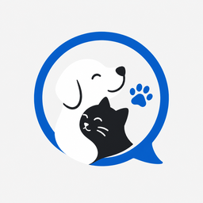
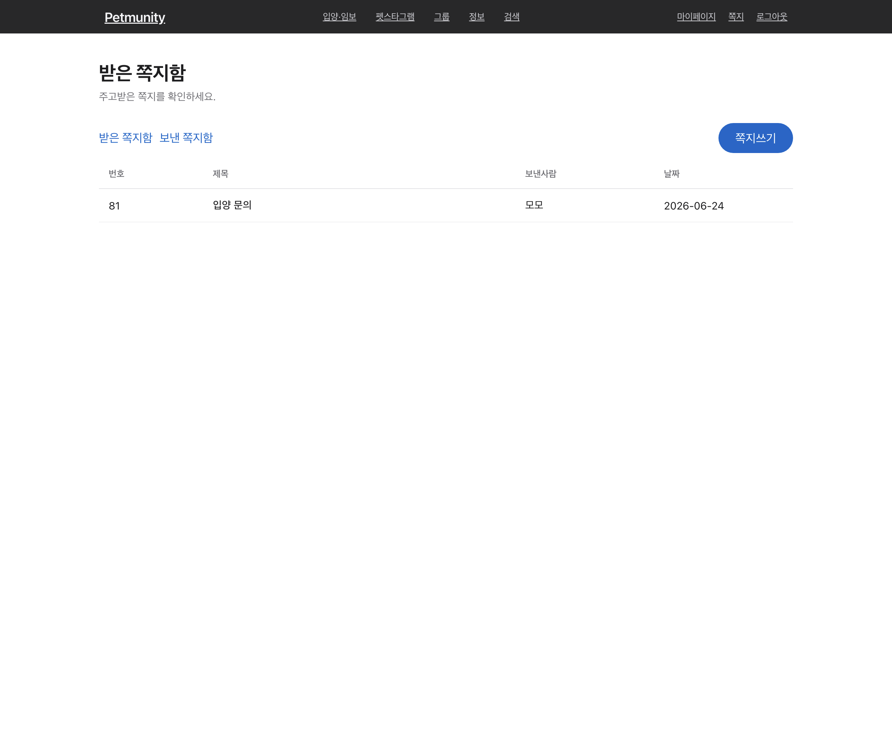
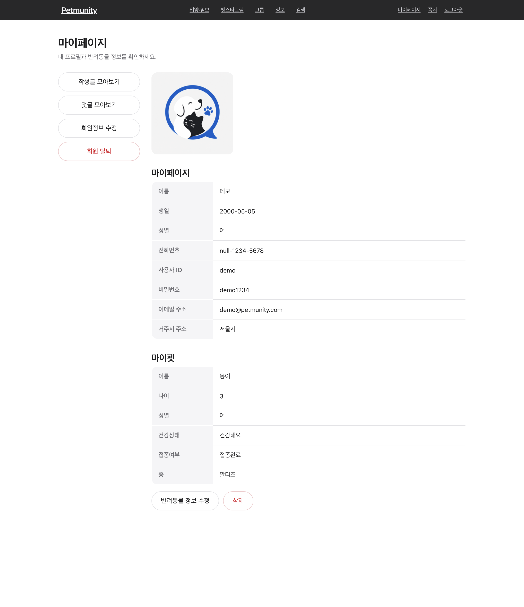
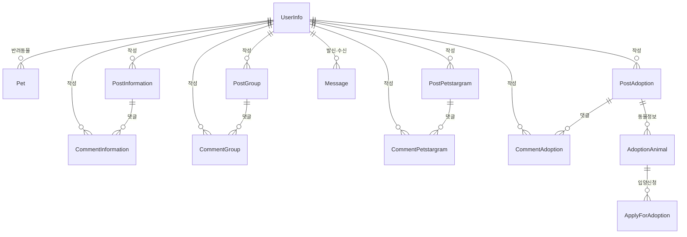

# PETMUNITY

> ### "반려동물과 함께하는 모든 순간을, 한 곳에서"
>
> 입양·임보로 새 가족을 만나고,
> 우리 아이의 일상을 자랑하고, 정보를 나누고, 모임을 만드는 반려동물 커뮤니티

- **서비스명**: Petmunity (Pet + Community)
- **개발 기간**: 2022 <!-- 실제 기간으로 수정하세요 -->
- **개발 인원**: 팀 프로젝트 <!-- 인원 수로 수정하세요 -->
- **프로젝트**: 데이터베이스 프로그래밍 팀 프로젝트
- **서비스 목적**: 입양·임보, 펫스타그램(일상 공유), 그룹 모임, 정보 공유, 쪽지까지 — 반려 생활에 필요한 커뮤니티 활동을 하나의 웹 서비스로 제공

<div align="center">
  
  <br/><br/>
  
</div>

# 목차

- [팀원](#팀원)
- [기획 배경](#기획-배경)
- [서비스 소개](#서비스-소개)
- [주요 화면 및 기능 소개](#주요-화면-및-기능-소개)
- [프로젝트 핵심 기술](#프로젝트-핵심-기술)
- [시스템 아키텍처](#시스템-아키텍처)
- [ERD](#erd)
- [DB 적용 및 실행](#db-적용-및-실행)
- [시연 체크리스트](#시연-체크리스트)
- [프로젝트 구조](#프로젝트-구조)
- [기술 스택](#기술-스택)

# 팀원

<!-- 실제 팀원으로 채워주세요 -->

<table>
  <tr>
    <td align="center" width="160">
      <a href="https://github.com/sondahyun"><br/><b>손다현</b></a><br/>
      <sub>@sondahyun</sub>
    </td>
    <td align="center" width="160">
      <b>팀원</b><br/>
      <sub>@github-id</sub>
    </td>
    <td align="center" width="160">
      <b>팀원</b><br/>
      <sub>@github-id</sub>
    </td>
  </tr>
</table>

# 기획 배경

반려 생활에 필요한 정보와 교류는 보통 여러 곳에 흩어져 있습니다. 입양 공고는 보호소·카페·블로그에, 일상 사진은 SNS에, 사육 정보는 검색 곳곳에, 모임은 단톡방에 따로따로 존재합니다. 반려인이 "입양받고 → 키우면서 → 자랑하고 → 정보를 나누고 → 사람들과 모이는" 흐름을 한 번에 이어가기는 어렵습니다.

Petmunity는 이 **흩어진 반려 생활을 하나의 커뮤니티로 묶기 위해** 기획되었습니다. 입양·임보 공고와 신청, 펫스타그램(일상 공유), 정보 게시판, 그룹 모임, 회원 간 쪽지를 한 플랫폼에서 제공해, 반려인이 필요한 활동을 한 곳에서 끝낼 수 있도록 설계했습니다.

또한 **데이터베이스 프로그래밍** 교과 프로젝트인 만큼, 스프링·마이바티스 같은 프레임워크에 기대지 않고 **관계형 DB 설계와 순수 JDBC로 직접 구현**하여 웹 백엔드의 동작 원리를 밑바닥부터 다루는 데 초점을 맞췄습니다.

# 서비스 소개

Petmunity는 **4개의 커뮤니티 게시판**을 중심으로 한 반려동물 통합 커뮤니티입니다.

- **입양 · 임보** — 입양 공고(동물 정보 포함)를 올리고, 다른 사용자가 **입양 신청서**를 제출합니다.
- **펫스타그램** — 반려동물의 사진과 일상을 공유하고 댓글로 소통합니다.
- **그룹** — 관심사가 비슷한 반려인들이 모임을 만들고 참여합니다.
- **정보** — 건강·돌봄·생활 정보를 글과 댓글로 나눕니다.

여기에 **2단계 회원가입(사람 정보 → 반려동물 정보)**, **회원 간 쪽지**, **통합 검색**, **마이페이지(내 글·댓글 모아보기)** 가 더해져, 단순 게시판이 아니라 사용자가 **직접 올리고 · 신청하고 · 소통하는** 흐름으로 구성된 점이 특징입니다.

# 주요 화면 및 기능 소개

> 📸 캡처 이미지를 `docs/` 폴더에 넣으면 아래 형식대로 표시됩니다. (경로는 예시입니다.)

## 회원 · 인증

<table>
  <tr>
    <th width="33%">로그인</th>
    <th width="33%">회원가입 (1단계 · 회원)</th>
    <th width="33%">회원가입 (2단계 · 반려동물)</th>
  </tr>
  <tr>
    <td></td>
    <td></td>
    <td></td>
  </tr>
</table>

- **2단계 회원가입** — 회원 정보 입력 후 반려동물 정보 등록(없으면 건너뛰기 가능)
- 세션 기반 로그인 · 로그아웃, 글쓰기 등 보호된 동작은 로그인 사용자만
- 회원 정보 수정 · 회원 탈퇴
- 로그인 실패 시 사용자 친화적 메시지 안내

## 커뮤니티 게시판 (입양 · 펫스타그램 · 그룹 · 정보)

<table>
  <tr>
    <th width="33%">입양 · 임보 목록</th>
    <th width="33%">펫스타그램</th>
    <th width="33%">정보 게시판</th>
  </tr>
  <tr>
    <td></td>
    <td></td>
    <td></td>
  </tr>
</table>

- 4개 게시판 공통 **글 작성 · 조회 · 수정 · 삭제(CRUD)** 와 **이미지 업로드**
- **입양 · 임보**: 입양 공고글 + 동물 정보(종·성별·나이·건강·접종·사진) 동시 등록, 다른 사용자의 **입양 신청서** 접수
- **펫스타그램 · 정보**: 글 + 사진, **댓글** 작성·수정·삭제(작성자 권한 확인)
- **그룹**: 모임 개설, 모집 인원 설정, 멤버 참여

## 쪽지 · 통합 검색 · 마이페이지

<table>
  <tr>
    <th width="33%">쪽지함</th>
    <th width="33%">통합 검색</th>
    <th width="33%">마이페이지</th>
  </tr>
  <tr>
    <td></td>
    <td></td>
    <td></td>
  </tr>
</table>

- **쪽지** — 회원 간 쪽지 보내기(받은/보낸 쪽지함), **수신자 존재 확인** 후 전송, **나에게 보내기** 지원
- **통합 검색** — 커뮤니티 종류 선택 + 키워드(+ 기간)로 게시글을 한 번에 검색, 결과를 게시판 구분과 함께 표시
- **마이페이지** — 내가 쓴 글 · 내 댓글 모아보기, 회원 정보 수정

# 프로젝트 핵심 기술

## 프레임워크 없는 MVC — 프런트 컨트롤러 직접 구현

- 모든 요청을 **`DispatcherServlet`(Front Controller)** 한 곳에서 받고, `RequestMapping`이 URL → `Controller`로 분기합니다.
- 각 `Controller`는 공통 인터페이스(`execute`)를 구현해 처리 결과로 **forward(JSP)** 경로 또는 **`redirect:` 경로**를 반환하고, 디스패처가 이동을 담당합니다(반환값이 `null`이면 응답 직접 처리).

## 커넥션 풀 기반 DB 접근 (DBCP2)

- 매 요청마다 커넥션을 새로 만들지 않고 **Apache Commons DBCP2 커넥션 풀**에서 빌려 쓰고 반납합니다.
- `ConnectionManager`(풀 래퍼) → `JDBCUtil`(쿼리 실행 · 트랜잭션) → `DAO` 로 이어지는 데이터 접근 계층을 직접 설계했고, 커밋/롤백과 자원 반납을 명시적으로 다루며 순수 JDBC를 학습했습니다.
- 시퀀스(`user_seq`, `p0_seq`~`p3_seq`, `c0_seq`~`c3_seq` 등)로 PK를 생성합니다.

## 4개 게시판의 일관된 도메인 구조 (P0~P3)

- 정보(P0) · 그룹(P1) · 펫스타그램(P2) · 입양(P3) 게시판을 **동일한 번호 체계**로 통일해, 게시글(`Post*`)과 댓글(`Comment*`) · DAO · 컨트롤러를 일관된 패턴으로 구현했습니다.
- 입양(P3)은 공고글에 **동물 정보(`AdoptionAnimal`)** 를 함께 등록하고, **입양 신청서(`ApplyForAdoption`)** 로 신청을 받는 확장 워크플로우를 가집니다.

## 이미지 업로드 — S3 / 로컬 전환형 저장소 + 스트리밍 서빙

- 업로드 이미지는 **영문 파일명(UUID + 확장자)** 으로 저장해 한글 파일명·인코딩 이슈를 피합니다.
- `StorageUtil`이 저장소를 추상화 — `aws.properties`에 S3 설정이 있으면 **AWS S3**에, 없으면 **로컬 폴더**에 자동 저장(폴백)합니다. 자격증명은 `.gitignore` 처리해 커밋되지 않습니다.
- 저장된 이미지는 `ImageController`가 `/image?file=...` 로 **직접 스트리밍**해, 톰캣 정적 서빙 캐시 문제를 우회합니다.

## 회원 간 쪽지 · 통합 검색

- 쪽지 전송 시 **수신자(loginId) 존재를 검증**해 없는 사용자에게는 보낼 수 없고, **나에게 보내기**도 지원합니다.
- 통합 검색은 커뮤니티 종류 · 키워드 · 기간 조건으로 4개 게시판을 한 번에 조회해 결과를 통합 목록으로 보여줍니다.

# 시스템 아키텍처

프런트 컨트롤러 패턴 기반의 **계층형 MVC** 구조입니다.

```text
User Browser
  └─ Filter (Encoding · Resource)
      └─ DispatcherServlet  (Front Controller)
          └─ RequestMapping  (URL → Controller 매핑)
              └─ Controller   (요청 처리, forward / redirect 결정)
                  └─ UserManager  (Service · 비즈니스 로직, 싱글톤 Facade)
                      └─ DAO → JDBCUtil → ConnectionManager (DBCP2 Pool)
                          └─ Oracle DB
          └─ View : JSP + JSTL   (forward 시 렌더링)
      └─ ImageController → StorageUtil (S3 / 로컬)  → 이미지 스트리밍
```

**요청 처리 흐름**

1. 모든 요청은 `Filter`(UTF-8 인코딩 · 정적 리소스)를 거쳐 `DispatcherServlet`으로 진입
2. `RequestMapping`이 URL에 맞는 `Controller`를 찾음 (없으면 404)
3. `Controller` → `UserManager` → `DAO` → 커넥션 풀 순으로 DB 작업 수행
4. 결과에 따라 JSP **forward** 또는 **redirect** 반환 (Ajax/이미지 등은 응답 직접 처리)

# ERD

핵심 엔티티 관계 (간략화)



> 게시판은 정보(P0)·그룹(P1)·펫스타그램(P2)·입양(P3) 4종이며 각각 `Post*` / `Comment*` 테이블을 가집니다. 입양 게시판은 `AdoptionAnimal`(동물 정보)과 `ApplyForAdoption`(입양 신청서)을 추가로 사용합니다. 전체 스키마는 [`src/main/resources/schema.sql`](src/main/resources/schema.sql) 참고.

# DB 적용 및 실행

## 1) 데이터베이스 준비

Oracle에 접속해 스키마를 생성합니다. (테이블 13개 + 시퀀스 13개)

```sql
@src/main/resources/schema.sql
```

DB 접속 정보는 `src/main/resources/context.properties`에서 설정합니다.

```properties
db.driver=oracle.jdbc.driver.OracleDriver
db.url=jdbc:oracle:thin:@<host>:<port>/<service>
db.username=<user>
db.password=<password>
```

## 2) (선택) 이미지 S3 저장 설정

`aws.properties.example`를 `aws.properties`로 복사해 값을 채우면 이미지가 S3에 저장됩니다. **비워두면 로컬 폴더에 저장**되며, `aws.properties`는 git에 커밋되지 않습니다.

```properties
aws.s3.bucket=<bucket>
aws.s3.region=ap-northeast-2
aws.accessKeyId=<access-key>
aws.secretAccessKey=<secret-key>
```

## 3) 빌드 · 실행

```bash
mvn -q -DskipTests package
```

성공하면 `target/Petmunity-0.0.1-SNAPSHOT.war`를 **Tomcat 9**에 배포한 뒤 `http://localhost:8080/Petmunity/` 로 접속합니다.

# 시연 체크리스트

- 2단계 회원가입(회원 → 반려동물) 후 로그인
- 각 게시판에서 글 작성 + 이미지 업로드, 목록 · 상세 조회
- 입양 게시판: 공고글 + 동물 정보 등록 → 다른 계정으로 입양 신청서 제출
- 펫스타그램 · 정보 게시판: 댓글 작성 · 수정 · 삭제(작성자 권한)
- 쪽지: 존재하는 사용자에게 전송 / 없는 사용자 전송 차단 / 나에게 보내기
- 통합 검색: 커뮤니티 · 키워드로 검색해 통합 결과 확인
- 마이페이지: 내 글 · 내 댓글 모아보기, 회원 정보 수정

# 프로젝트 구조

```text
petmunity/
├── pom.xml                              # Maven 의존성 / 빌드 설정
└── src/main
    ├── java
    │   ├── controller                   # 프런트 컨트롤러 + 도메인별 Controller
    │   │   ├── DispatcherServlet.java   #   └ 진입점 (Front Controller)
    │   │   ├── RequestMapping.java      #   └ URL ↔ Controller 매핑
    │   │   ├── ImageController.java     #   └ 업로드 이미지 스트리밍
    │   │   └── post / comment / user / pet / message / apply
    │   ├── filter                       # EncodingFilter, ResourceFilter
    │   ├── model
    │   │   ├── (도메인)                 # UserInfo, Pet, Post*, Comment*, AdoptionAnimal, Apply, Message
    │   │   ├── service                  # UserManager (비즈니스 로직, 싱글톤 Facade) + 예외
    │   │   └── dao                      # DAO + JDBCUtil + ConnectionManager (DBCP2)
    │   └── util                         # StorageUtil (S3 / 로컬 이미지 저장)
    ├── resources                        # context.properties(DB), schema.sql, aws.properties(.example)
    └── webapp
        ├── css / images / font          # 정적 리소스
        └── WEB-INF
            ├── web.xml                  # 서블릿 · 필터 매핑
            ├── navbar.jsp               # 공통 내비게이션 + 디자인 시스템
            ├── main / community / user / myPage / message / search
```

# 기술 스택

### Language · View

<div>
  
  
  
</div>

### Web · DB

<div>
  
  
  
  
  
</div>

### Storage · Build · Etc.

<div>
  
  
  
  
  
</div>

<br/>

<div align="center">

**Petmunity** · Database Programming Team Project

</div>
